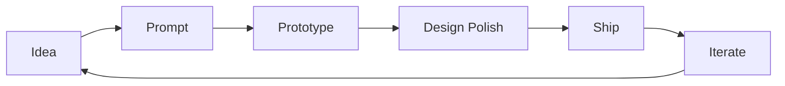

## Hi, I'm Saber

### Vibe Coding Builder

我喜欢把模糊想法快速变成可上线的产品。

- 用 Copilot、Codex 等 AI 工具把开发节奏拉满
- 兼顾产品设计、前后端实现和最终交付
- 偏爱有速度感、有审美、有完整闭环的项目

📝 分享文档： [我的文档](https://ai.feishu.cn/wiki/HGBiwFMiFi6bXPkK1azcDzpenGf)

---

### My Vibe

> Prompt first. Prototype fast. Polish hard. Ship early.



```text
while (idea) {
  prompt();
  build();
  refine();
  launch();
}
```

---

### What I Build

- 从 0 到 1 的产品原型和 MVP
- Web / Mobile / 小程序等多端应用
- AI + Agent 应用 + 工具型产品 + 可视化交互体验

### Main Loadout

- Frontend: Vue, React, Next.js, TypeScript, Vite
- Backend: Node.js, Go, Python, Java, Rust
- Design: Figma, MasterGo, Axure
- Extra: Mapbox, OpenLayers, Three.js, Flutter, React Native

### Working Style

- 先把想法跑起来，再把体验打磨好
- 能用 AI 提速的环节，绝不手搓重复劳动
- 会把 Agent 工作流、工具调用和产品体验一起设计进去
- 不只写页面，也会考虑信息结构、交互和上线落地
